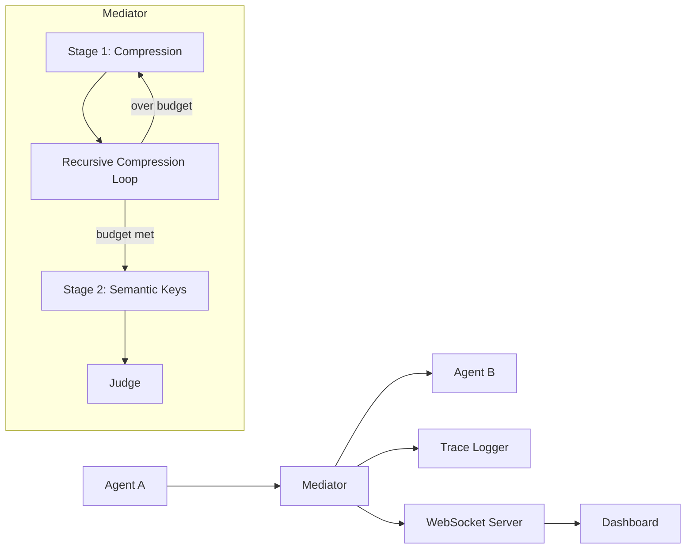

# Design Document: Mediated Minimal-Signaling Architecture

## Overview

This document describes the technical design for the Mediated Minimal-Signaling Architecture, a research prototype that enforces communication bottlenecks between LLM agents. The system implements a two-stage transformation pipeline with optional verification, enabling study of minimal information exchange for agent coordination.

The architecture follows a modular design with clear interfaces between components, allowing researchers to swap compression models, extraction strategies, and verification approaches without modifying the core pipeline.

## Architecture



### High-Level Flow

1. Agent A sends a natural language message to the Mediator
2. Stage 1 (Compression) reduces the message to fit the token budget via recursive summarization
3. Stage 2 (Semantic Key Extraction) converts compressed text to structured symbolic keys
4. Optional Judge verifies semantic key fidelity
5. Semantic keys + metadata are delivered to Agent B
6. All stages emit events to the WebSocket server for real-time dashboard visualization
7. Complete trace is logged to JSONL

## Components and Interfaces

### Core Interfaces

```python
from abc import ABC, abstractmethod
from dataclasses import dataclass
from typing import List, Optional
from enum import Enum

class KeyType(Enum):
    INSTRUCTION = "INSTRUCTION"
    STATE = "STATE"
    GOAL = "GOAL"
    CONTEXT = "CONTEXT"
    CONSTRAINT = "CONSTRAINT"

@dataclass
class SemanticKey:
    type: KeyType
    value: str

@dataclass
class CompressionResult:
    compressed_text: str
    original_tokens: int
    final_tokens: int
    passes: int
    log: List[dict]

@dataclass
class ExtractionResult:
    keys: List[SemanticKey]
    schema_version: str
    raw_output: str

@dataclass
class JudgeResult:
    passed: bool
    confidence: float
    issues: List[str]

class Compressor(ABC):
    @abstractmethod
    def compress(self, text: str) -> str:
        """Compress text to a shorter form."""
        pass

class SemanticKeyExtractor(ABC):
    @abstractmethod
    def extract(self, text: str) -> ExtractionResult:
        """Extract semantic keys from text."""
        pass

class Judge(ABC):
    @abstractmethod
    def evaluate(self, original: str, keys: List[SemanticKey]) -> JudgeResult:
        """Evaluate if keys faithfully represent the original."""
        pass

class Tokenizer(ABC):
    @abstractmethod
    def count_tokens(self, text: str) -> int:
        """Count tokens in text."""
        pass
```

### Mediator Component

The Mediator orchestrates the pipeline and manages configuration:

```python
@dataclass
class MediatorConfig:
    token_budget: int
    recursion_limit: int
    compression_enabled: bool
    extraction_enabled: bool
    judge_enabled: bool
    trace_dir: str

class Mediator:
    def __init__(
        self,
        config: MediatorConfig,
        compressor: Compressor,
        extractor: SemanticKeyExtractor,
        judge: Optional[Judge],
        tokenizer: Tokenizer,
        event_emitter: EventEmitter
    ): ...
    
    def process(self, message: str) -> MediatorResult:
        """Process a message through the full pipeline."""
        pass
```

### Stage 1: Compression Engine

```python
class CompressionEngine:
    def __init__(
        self,
        compressor: Compressor,
        tokenizer: Tokenizer,
        budget: int,
        max_passes: int,
        event_emitter: EventEmitter
    ): ...
    
    def compress_to_budget(self, text: str) -> CompressionResult:
        """Recursively compress until budget is met or limit reached."""
        pass
```

### Stage 2: Semantic Key Extractor

```python
class DistilBARTCompressor(Compressor):
    """DistilBART-based summarization compressor."""
    def __init__(self, model_name: str = "sshleifer/distilbart-cnn-12-6"): ...
    def compress(self, text: str) -> str: ...

class PlaceholderExtractor(SemanticKeyExtractor):
    """Deterministic placeholder for initial development."""
    def extract(self, text: str) -> ExtractionResult: ...

class LLMExtractor(SemanticKeyExtractor):
    """LLM-based semantic key extraction."""
    def __init__(self, model: str): ...
    def extract(self, text: str) -> ExtractionResult: ...
```

### Event System for Real-Time Updates

```python
class PipelineEvent(Enum):
    MESSAGE_RECEIVED = "message_received"
    COMPRESSION_START = "compression_start"
    COMPRESSION_PASS = "compression_pass"
    COMPRESSION_COMPLETE = "compression_complete"
    EXTRACTION_START = "extraction_start"
    EXTRACTION_COMPLETE = "extraction_complete"
    JUDGE_START = "judge_start"
    JUDGE_COMPLETE = "judge_complete"
    PIPELINE_COMPLETE = "pipeline_complete"
    PIPELINE_ERROR = "pipeline_error"

@dataclass
class EventPayload:
    event: PipelineEvent
    timestamp: datetime
    data: dict

class EventEmitter(ABC):
    @abstractmethod
    async def emit(self, payload: EventPayload) -> None:
        """Emit an event to all subscribers."""
        pass
```

### WebSocket Server

```python
class WebSocketServer:
    def __init__(self, host: str, port: int): ...
    
    async def broadcast(self, payload: EventPayload) -> None:
        """Broadcast event to all connected clients."""
        pass
    
    async def start(self) -> None:
        """Start the WebSocket server."""
        pass
```

### Dashboard Backend

```python
class DashboardServer:
    def __init__(
        self,
        mediator: Mediator,
        ws_server: WebSocketServer,
        static_dir: str
    ): ...
    
    async def handle_message(self, message: str) -> None:
        """Handle incoming message from dashboard."""
        pass
    
    def run(self, host: str, port: int) -> None:
        """Run the dashboard server."""
        pass
```

## Data Models

### Configuration Schema

```yaml
mediator:
  compression:
    enabled: true
    token_budget: 50
    max_recursion: 5
    model: "sshleifer/distilbart-cnn-12-6"
  
  semantic_keys:
    enabled: true
    schema_version: "1.0"
    extractor: "placeholder"  # or "llm"
  
  judge:
    enabled: false

logging:
  level: "INFO"
  trace_dir: "traces"

dashboard:
  enabled: true
  host: "localhost"
  port: 8080
  ws_port: 8081
```

### Semantic Key Schema (v1.0)

```json
{
  "$schema": "http://json-schema.org/draft-07/schema#",
  "type": "object",
  "properties": {
    "schema_version": {"type": "string"},
    "keys": {
      "type": "array",
      "items": {
        "type": "object",
        "properties": {
          "type": {
            "type": "string",
            "enum": ["INSTRUCTION", "STATE", "GOAL", "CONTEXT", "CONSTRAINT"]
          },
          "value": {"type": "string"}
        },
        "required": ["type", "value"]
      }
    }
  },
  "required": ["schema_version", "keys"]
}
```

### Trace Record Schema

```json
{
  "timestamp": "2024-01-15T10:30:00Z",
  "message_id": "uuid",
  "original": {
    "text": "...",
    "tokens": 150
  },
  "compression": {
    "passes": [
      {"input_tokens": 150, "output_tokens": 80, "ratio": 0.53},
      {"input_tokens": 80, "output_tokens": 45, "ratio": 0.56}
    ],
    "final_text": "...",
    "final_tokens": 45,
    "total_ratio": 0.30
  },
  "extraction": {
    "keys": [...],
    "schema_version": "1.0"
  },
  "judge": {
    "passed": true,
    "confidence": 0.85,
    "issues": []
  },
  "duration_ms": 1250
}
```

## Correctness Properties

*A property is a characteristic or behavior that should hold true across all valid executions of a system-essentially, a formal statement about what the system should do. Properties serve as the bridge between human-readable specifications and machine-verifiable correctness guarantees.*

### Property 1: Token count consistency
*For any* text input, the tokenizer SHALL return a consistent, non-negative integer token count, and calling count_tokens multiple times on the same input SHALL return the same value.
**Validates: Requirements 1.1**

### Property 2: Compression reduces or maintains token count
*For any* text input to the compressor, the output token count SHALL be less than or equal to the input token count.
**Validates: Requirements 1.2**

### Property 3: Recursive compression termination
*For any* message and configuration, the compression engine SHALL terminate within max_recursion passes, regardless of whether the budget is achieved.
**Validates: Requirements 1.3, 1.4**

### Property 4: Compression result completeness
*For any* compression run, the CompressionResult SHALL contain non-null values for compressed_text, original_tokens, final_tokens, passes (>= 0), and a log list.
**Validates: Requirements 1.5**

### Property 5: Compressor interface substitutability
*For any* implementation of the Compressor interface, the Mediator SHALL process messages without errors when that implementation is injected.
**Validates: Requirements 2.3**

### Property 6: Extraction follows compression
*For any* successful compression, the compressed text SHALL be passed to the extractor, and extraction SHALL be invoked exactly once per pipeline run.
**Validates: Requirements 3.1**

### Property 7: Extraction result schema conformance
*For any* extraction result, the keys list SHALL contain only SemanticKey objects with valid KeyType values, and schema_version SHALL be non-empty.
**Validates: Requirements 3.2, 3.4**

### Property 8: Semantic key serialization round-trip
*For any* list of SemanticKey objects, serializing to JSON and deserializing back SHALL produce an equivalent list.
**Validates: Requirements 4.3**

### Property 9: Schema validation rejects invalid input
*For any* JSON input that does not conform to the semantic key schema, deserialization SHALL raise a validation error.
**Validates: Requirements 4.4**

### Property 10: Judge invocation follows configuration
*For any* pipeline run where judge_enabled is true, the Judge SHALL be invoked; where judge_enabled is false, the Judge SHALL NOT be invoked.
**Validates: Requirements 5.1, 5.4**

### Property 11: Judge result completeness
*For any* Judge evaluation, the JudgeResult SHALL contain a boolean passed field, a float confidence in [0, 1], and a list of issues (possibly empty).
**Validates: Requirements 5.2, 5.3**

### Property 12: Configuration validation
*For any* configuration with invalid values (negative budget, negative recursion limit), loading SHALL raise a validation error with a descriptive message.
**Validates: Requirements 6.7**

### Property 13: Trace record completeness
*For any* completed pipeline run, the trace record SHALL contain timestamp, original message metadata, compression steps, and extracted keys.
**Validates: Requirements 7.1-7.5**

### Property 14: End-to-end pipeline integrity
*For any* input message, the pipeline SHALL either complete successfully with a valid MediatorResult, or fail with a logged error—never silently drop messages.
**Validates: Requirements 8.1-8.4**

### Property 15: Metrics calculation accuracy
*For any* set of compression results, the aggregate compression ratio SHALL equal the sum of final tokens divided by the sum of original tokens.
**Validates: Requirements 12.1-12.3**

## Error Handling

### Error Categories

1. **Configuration Errors**: Invalid YAML, missing required fields, out-of-range values
   - Fail fast at startup with clear error messages
   
2. **Compression Errors**: Model loading failures, inference errors
   - Log error, emit PIPELINE_ERROR event, return error result
   
3. **Extraction Errors**: Schema validation failures, extractor errors
   - Log error, emit PIPELINE_ERROR event, return partial result with error flag
   
4. **Judge Errors**: Evaluation failures
   - Log warning, skip judge, proceed with result (judge is optional)
   
5. **WebSocket Errors**: Connection failures, broadcast errors
   - Log warning, continue pipeline (dashboard is non-critical)

### Error Response Format

```python
@dataclass
class PipelineError:
    stage: str
    error_type: str
    message: str
    recoverable: bool
```

## Testing Strategy

### Unit Testing

Unit tests will cover:
- Individual component behavior (Compressor, Extractor, Judge)
- Configuration loading and validation
- Serialization/deserialization
- Event emission

### Property-Based Testing

We will use **Hypothesis** for property-based testing to verify the correctness properties defined above.

Each property test will:
- Generate random inputs using Hypothesis strategies
- Execute the system under test
- Assert the property holds for all generated inputs
- Run a minimum of 100 iterations per property

Property tests will be tagged with comments referencing the design document:
```python
# **Feature: mediated-minimal-signaling, Property 8: Semantic key serialization round-trip**
```

### Integration Testing

Integration tests will cover:
- Full pipeline execution with mock components
- WebSocket event flow
- Trace file generation
- Dashboard communication

### Test Organization

```
tests/
├── unit/
│   ├── test_compression.py
│   ├── test_extraction.py
│   ├── test_judge.py
│   ├── test_config.py
│   └── test_serialization.py
├── property/
│   ├── test_compression_properties.py
│   ├── test_extraction_properties.py
│   ├── test_pipeline_properties.py
│   └── test_serialization_properties.py
└── integration/
    ├── test_pipeline.py
    ├── test_websocket.py
    └── test_dashboard.py
```
