# Architecture Diagrams for Hierarchical Adaptive Encoding

## 1. Overall System Architecture

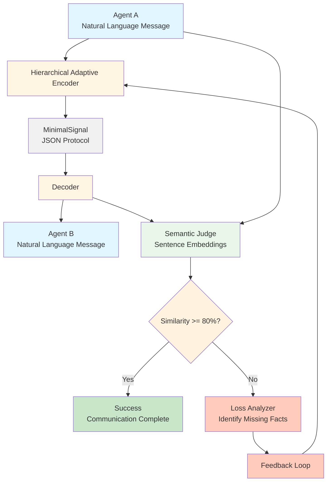

## 2. Three-Phase Hierarchical Encoding Process

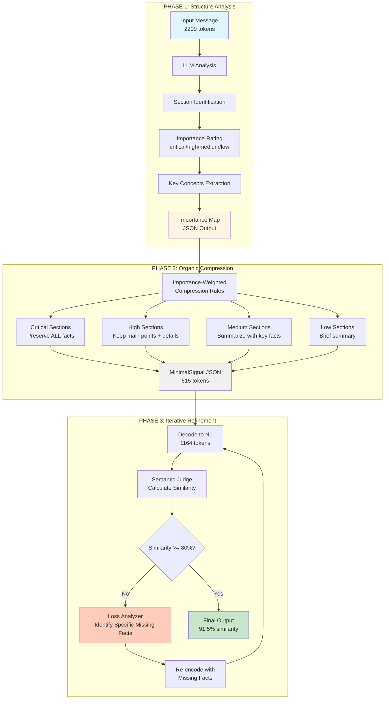

## 3. Comparison: Baseline vs Graph-Based vs Hierarchical Adaptive

```mermaid
graph TB
    subgraph "Baseline Approach"
        B1[Message] --> B2[Single-Pass Encoder<br/>'Compress by 30%']
        B2 --> B3[MinimalSignal]
        B3 --> B4[Decoder]
        B4 --> B5[Semantic Judge]
        B5 --> B6{Good?}
        B6 -->|No| B7[Vague Feedback<br/>'Some details missing']
        B7 --> B2
        B6 -->|Yes| B8[Done]
    end
    
    subgraph "Graph-Based Approach (Failed)"
        G1[Message] --> G2[Entity Extraction<br/>spaCy NLP]
        G2 --> G3[Build Knowledge Graph<br/>Nodes + Edges]
        G3 --> G4[Graph Compression<br/>PageRank Pruning]
        G4 --> G5[Graph Reconstruction<br/>Template Generation]
        G5 --> G6[Unnatural Text<br/>65% similarity ❌]
    end
    
    subgraph "Hierarchical Adaptive (Current)"
        H1[Message] --> H2[Structure Analysis<br/>Importance Rating]
        H2 --> H3[Organic Compression<br/>Importance-Weighted]
        H3 --> H4[MinimalSignal]
        H4 --> H5[Decoder]
        H5 --> H6[Semantic Judge]
        H6 --> H7{Good?}
        H7 -->|No| H8[Specific Feedback<br/>'MISSING: $1.2M revenue']
        H8 --> H3
        H7 -->|Yes| H9[Done<br/>91.5% similarity ✅]
    end
    
    style B8 fill:#fff3e0
    style G6 fill:#ffcdd2
    style H9 fill:#c8e6c9
```

## 4. Detailed Phase 1: Structure Analysis

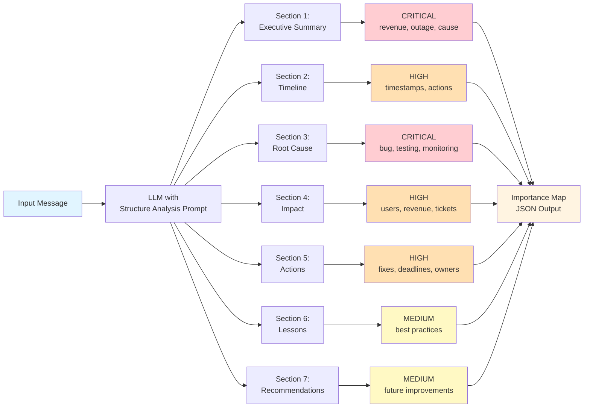

## 5. Detailed Phase 2: Importance-Weighted Compression

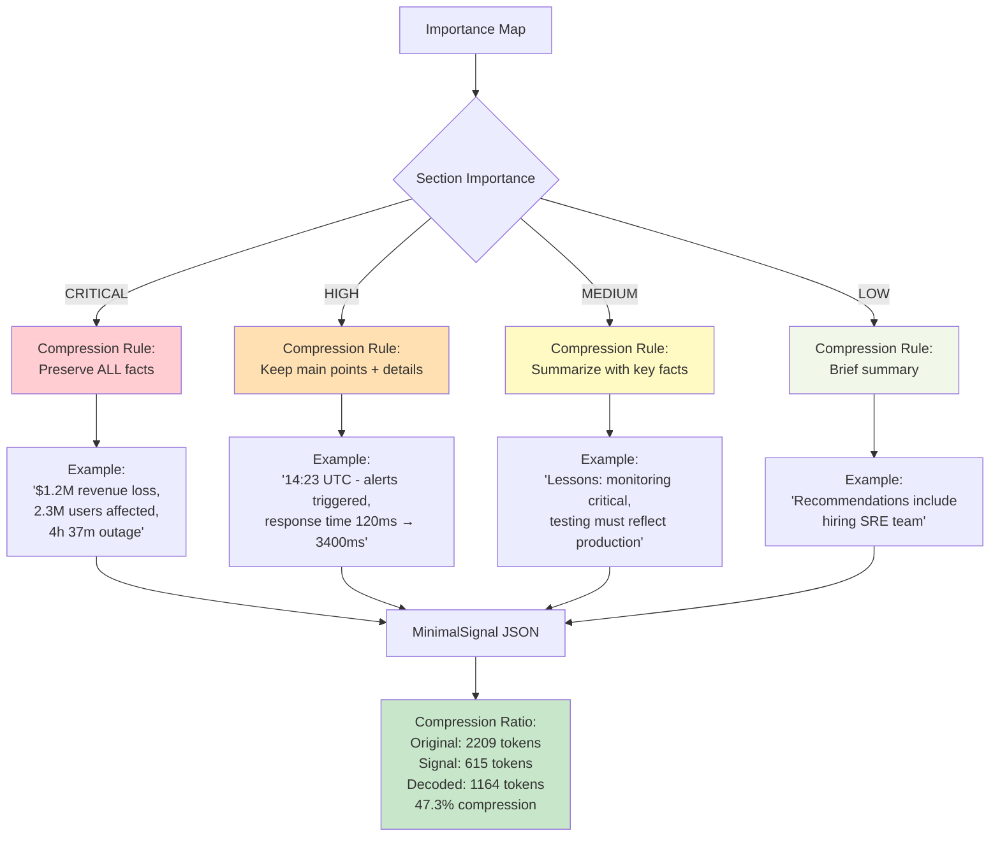

## 6. Detailed Phase 3: Iterative Refinement Loop

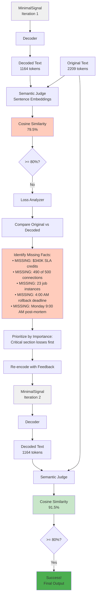

## 7. Message Length Impact on Compression Strategy

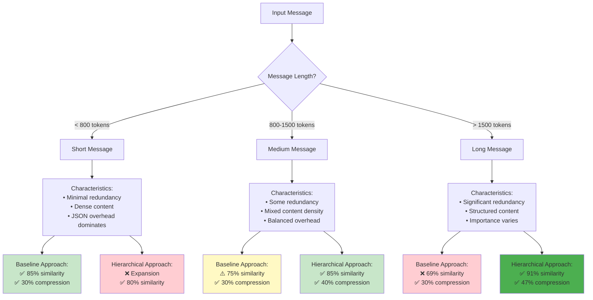

## 8. Semantic Similarity vs Compression Trade-off

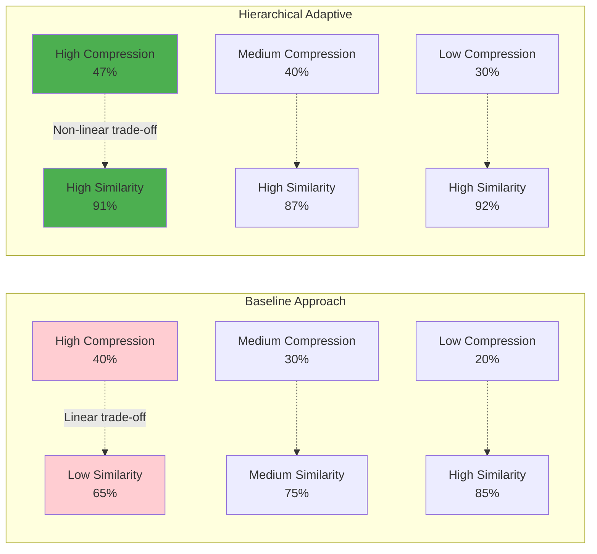

## 9. Data Flow: Original Message to Final Output

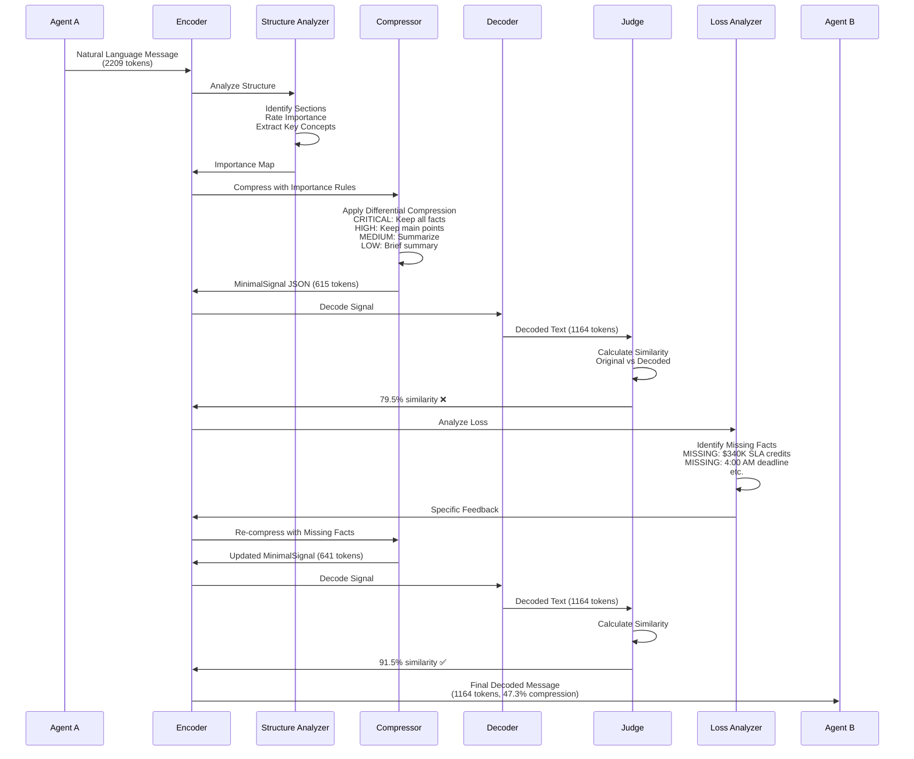

## 10. Component Architecture

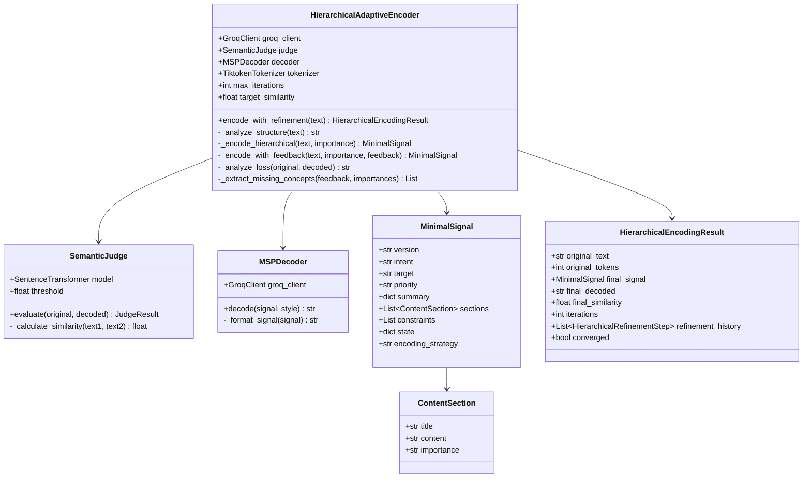

## 11. Prompt Engineering Flow

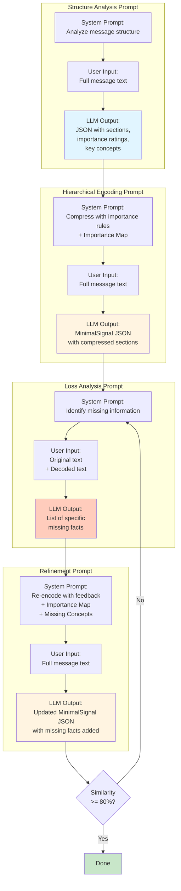

## 12. Performance Comparison Matrix

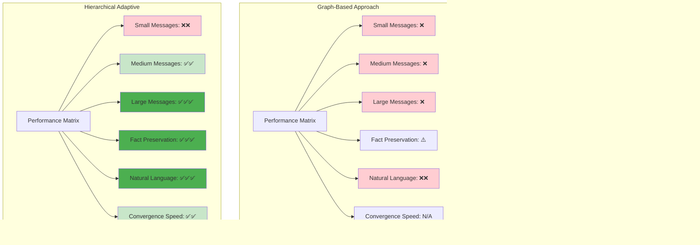

---

## How to Use These Diagrams

1. **For Thesis:** Copy the mermaid code blocks into your thesis document. Most markdown processors and thesis templates support mermaid diagrams.

2. **For Presentations:** Use online tools like:
   - https://mermaid.live/ (render and export as PNG/SVG)
   - https://mermaid.ink/ (generate image URLs)

3. **For Documentation:** These diagrams are already in markdown format and will render in GitHub, GitLab, and most documentation platforms.

4. **Key Diagrams for Your Prof:**
   - Diagram 2: Three-Phase Process (shows the core innovation)
   - Diagram 3: Comparison (shows why your approach is better)
   - Diagram 7: Message Length Impact (explains the trade-offs)
   - Diagram 9: Data Flow (shows the complete system)
