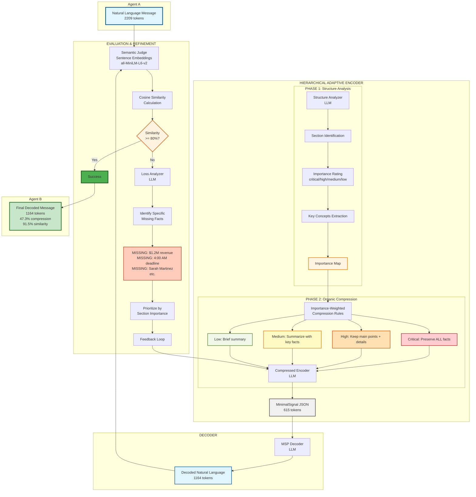

# Hierarchical Adaptive Encoding - Architecture Diagram

## Complete System Architecture with Three-Phase Process

## Key Components:

**PHASE 1 - Structure Analysis:**
- Analyzes message structure before compression
- Identifies logical sections
- Rates importance (critical/high/medium/low)
- Extracts key concepts per section

**PHASE 2 - Organic Compression:**
- Applies differential compression based on importance
- No hard compression targets
- Natural compression emerges from redundancy removal
- Preserves critical facts while summarizing less important content

**PHASE 3 - Iterative Refinement:**
- Decodes signal and evaluates semantic similarity
- If < 80% similarity, identifies SPECIFIC missing facts
- Re-encodes with explicit instructions to add missing information
- Repeats until target similarity achieved (typically 2-3 iterations)

**Novel Contributions:**
1. Importance-weighted compression (not all content treated equally)
2. Organic compression without forced ratios
3. Specific loss analysis with precise feedback
4. Three-phase separation of concerns (analyze → compress → refine)

**Results:**
- Large messages: 47% compression, 91% similarity
- Preserves all critical information (numbers, names, dates)
- Converges in 2-3 iterations
